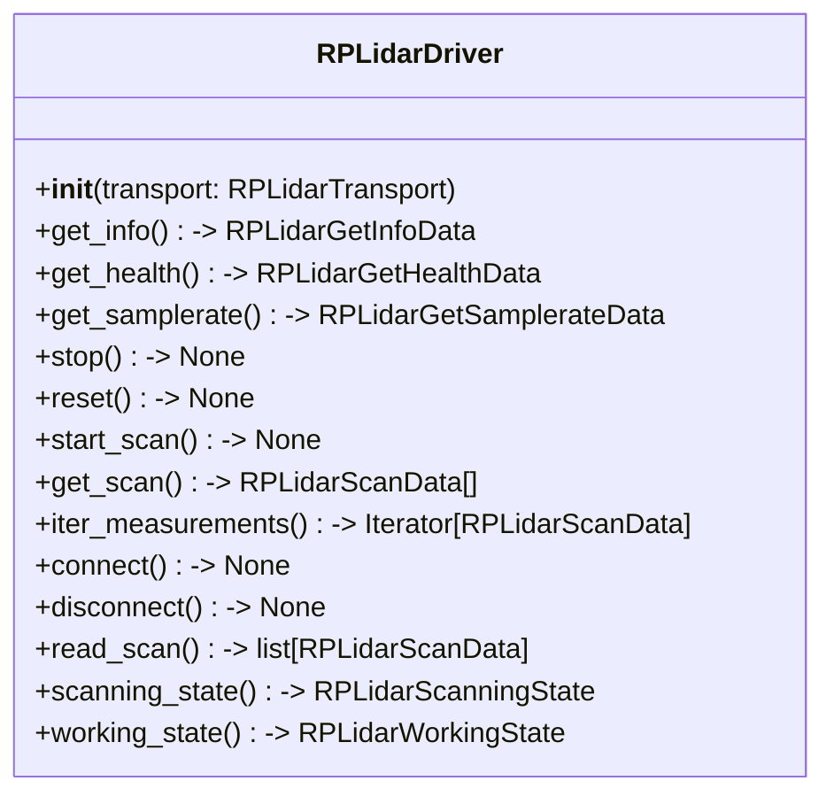
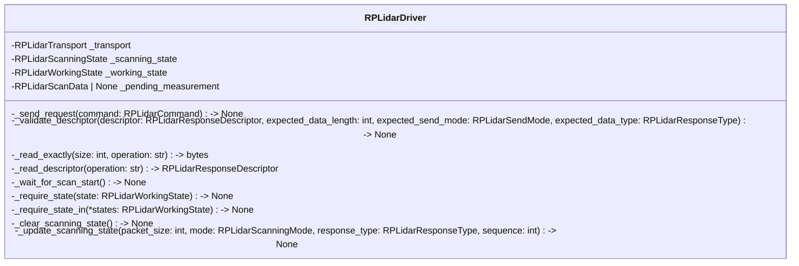
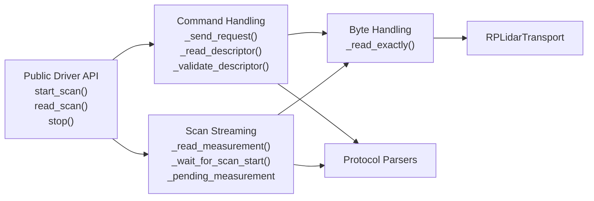
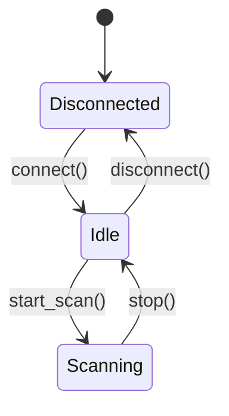
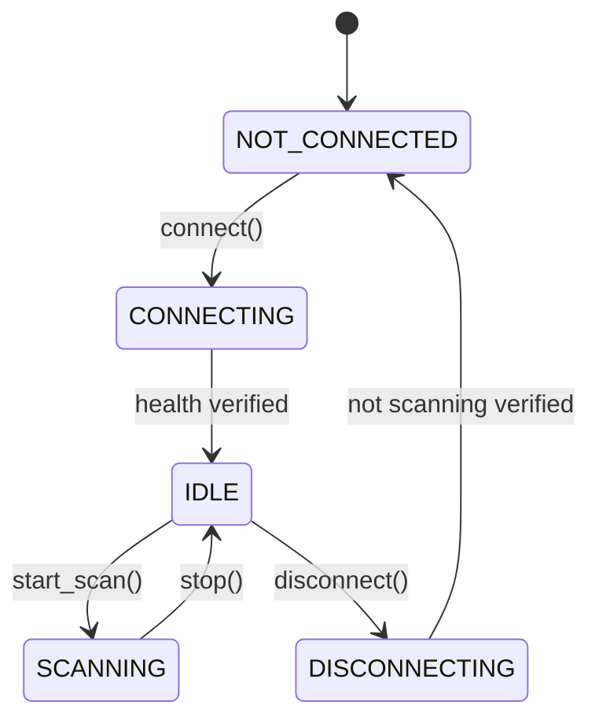

# RPLIDAR Driver API Documentation

## Responsibilities
The RPLIDAR Driver is responsible for managing the communication with the RPLIDAR device, including sending commands and receiving responses. The driver will govern the communication protocol. This layer acts as the high-level interface, which abstracts the underlying communication protocol and provides a simplified interface for interacting with the RPLIDAR device.

**API Abstraction:** It provides clean, object-oriented function calls such as:
    - `get_info()`
    - `get_health()`
    - `get_samplerate()`
    - `stop()`
    - `reset()`
    - `start_scan()`
  
**Data Processing & Conversion:** Using the `protocol` layer, the driver will handle the conversion of raw data received from the RPLIDAR device into structured data formats that can be easily consumed by other components of the system.

**Device State Management:** The driver will maintain the state of the RPLIDAR device, including tracking whether it is currently scanning, stopped, or in an error state. It will also handle any necessary initialization and cleanup procedures.

**Buffer Management:** The driver will manage internal buffers for storing incoming data from the RPLIDAR device. It will ensure that data is read and processed efficiently, minimizing latency and preventing data loss.

## Public API
The RPLIDAR Driver provides the following public API methods:
| Method | Description |
|--------|-------------------|
| `get_info() -> RPLidarGetInfoData` | Retrieves the device information from the RPLIDAR device. |
| `get_health() -> RPLidarGetHealthData` | Retrieves the device health status from the RPLIDAR device. |
| `get_samplerate() -> RPLidarGetSamplerateData` | Retrieves the device sample rate from the RPLIDAR device. |
| `stop() -> None` | Stops the RPLIDAR device from scanning. |
| `reset() -> None` | Resets the RPLIDAR device. |
| `start_scan() -> None` | Places RPLIDAR device on scanning status, and validats the repsonse descriptor. |
| `iter_measurements() -> Iterator[RPLidarScanData]`| Yields parsed measurements continuously until scanning stops. |
| `connect() -> None` | Establishes a connection to the RPLIDAR device. |
| `disconnect() -> None` | Closes the connection to the RPLIDAR device. |
| `read_scan() -> list[RPLidarScanData]`| Returns a list of measurements for one revolution of the RPLIDAR device. |
| `connect() -> None` | Establishes a connection to the RPLIDAR device. |
| `disconnect() -> None` | Closes the connection to the RPLIDAR device. |
| `scanning_state() -> RPLidarScanningState` | Retrieves the current scanning state of the RPLIDAR device. |
| `working_state() -> RPLidarWorkingState` | Retrieves the current working state of the RPLIDAR device. |
## Public API Class Diagram

## Error Handling
The RPLIDAR Driver will handle errors and exceptions that may occur during communication with the RPLIDAR device. It will raise appropriate exceptions for various error conditions, such as communication timeouts, invalid responses, or device errors. The driver will also provide error codes and messages to help diagnose issues and facilitate troubleshooting.

## Internal Design
The internal implementation of the RPLIDAR Driver involves managing the communication protocol, handling raw data conversion, and maintaining the device state. It includes private methods for sending requests, reading responses, and updating the scanning and working states. The driver also manages internal buffers to ensure efficient data processing and minimal latency.

### Internal Design Class Diagram


### Command and Response Handling
|Internal Method | Responsibility |
|:---|:---|
| `_send_request(command: RPLidarCommand) -> None` | Sends a request command to the RPLIDAR device. |
| `_validate_descriptor(descriptor: RPLidarResponseDescriptor, expected_data_length: int, expected_send_mode: RPLidarSendMode, expected_data_type: RPLidarResponseType) -> None` | Validates the response descriptor against the expected values. |
| `_read_exactly(size: int, operation: str) -> bytes` | Reads the exact number of bytes from the device for a given operation. |
| `_read_descriptor(operation: str) -> RPLidarResponseDescriptor` | Reads the response descriptor from the device for a given operation. |
### Scan-stream Handling
|Internal Method | Responsibility |
|:---|:---|
| `_wait_for_scan_start() -> None` | Synchronizes to the start of a revolution of the RPLIDAR device. |
| `_require_state(state: RPLidarWorkingState) -> None` | Ensures the device is in the specified working state. |
| `_require_state_in(*states: RPLidarWorkingState) -> None` | Ensures the device is in one of the allowed working states. |
| `_clear_scanning_state() -> None` | Clears the current scanning state and sets connected default values for the scanning state attributes. |
| `_update_scanning_state(packet_size: int, mode: RPLidarScanningMode, response_type: RPLidarResponseType, sequence: int) -> None` | Updates the current scanning state with new values. |

### Buffer Strategy

The RPLIDAR Driver employs a buffer strategy to efficiently manage incoming data from the device. It maintains internal buffers to store raw data and ensures that data is read and processed in a timely manner. 


## Internal Component Diagram



## State Management

The RPLIDAR Driver maintains the current state of the device, including both the scanning state and the working state. The scanning state tracks the progress of ongoing scans, while the working state reflects the operational mode of the device. In order to ensure that the device operates correctly, the driver carefully manages state transitions and validates the current state before executing operations.






## Defined Internal Driver States
__IDLE Driver State:__
- [ ] `working_state == IDLE`
- [ ] `scanning_state.is_active is False`
- [ ] `scanning_state.mode == INACTIVE`
- [ ] `scanning_state.response_type is None`
- [ ] `scanning_state.packet_size == 0`
- [ ] `scanning_state.sequence == 0`
- [ ] `_pending_measurement is None`

__SCANNING Driver State:__
- [ ] `working_state == SCANNING`
- [ ] `scanning_state.is_active is True`
- [ ] `scanning_state.mode == STANDARD_SCAN`
- [ ] `scanning_state.response_type == MEASUREMENT_DATA`
- [ ] `scanning_state.packet_size == 5`
- [ ] `scanning_state.sequence >= 0`
- [ ] `_pending_measurement is None` or
      `isinstance(_pending_measurement, RPLidarScanData)`
- [ ] If `_pending_measurement` is not `None`,
      `_pending_measurement.start_flag is True`

__NOT_CONNECTED Driver State:__
- [ ] `working_state == NOT_CONNECTED`
- [ ] `scanning_state.is_active is False`
- [ ] `scanning_state.mode == INACTIVE`
- [ ] `scanning_state.response_type is None`
- [ ] `scanning_state.packet_size == 0`
- [ ] `scanning_state.sequence == 0`
- [ ] `_pending_measurement is None`

__PROTECTION_STOP Driver State:__
- [ ] `working_state == PROTECTION_STOP`
- [ ] `scanning_state.is_active is False`
- [ ] `scanning_state.mode == INACTIVE`
- [ ] `scanning_state.response_type is None`
- [ ] `scanning_state.packet_size == 0`
- [ ] `scanning_state.sequence == 0`
- [ ] `_pending_measurement is None`


## Usage Example
```python
from rtrpp.sensors.rplidar.driver import RPLidarDriver
from rtrpp.sensors.rplidar.transport import RPLidarTransport

transport = RPLidarTransport(port="/dev/ttyUSB0")

try:
    transport.open()  # Open the serial connection to the RPLIDAR device
    driver = RPLidarDriver(transport)

    info = driver.get_info()  # Retrieve device information
    health = driver.get_health()  # Retrieve device health status
    samplerate = driver.get_samplerate()  # Retrieve device sample rate

finally:
    transport.close()  # Close the serial connection to the RPLIDAR device
```


## Warning Policy

Warnings indicate that the requested operation completed successfully,
but the device reported a non-fatal condition that the caller should
be aware of.

Warnings never change the successful completion of an operation.

Exceptions indicate that the requested operation failed and its
postconditions were not achieved.

Warnings are typically used to signal conditions such as:
- Device health status is `WARNING`
- Non-critical sensor errors


## Future Enhancements
- Implement `read_extended_scan() -> list[RPLidarScanData]` to retrieve extended scan data from the RPLIDAR device.
- Implement `get_lidar_conf() -> RPLidarLidarConfData` to retrieve the LIDAR configuration from the RPLIDAR device.
- Implement `get_device_conf() -> RPLidarDeviceConfData` to retrieve the device configuration from the RPLIDAR device.
- Implement `get_scan_mode_count() -> int` to retrieve the number of available scan modes from the RPLIDAR device.
- Implement `get_scan_mode_us_per_sample() -> int` to retrieve the microseconds per sample for the current scan mode from the RPLIDAR device.
- Implement `get_scan_mode_max_distance() -> float` to retrieve the maximum distance for the current scan mode from the RPLIDAR device.
- Implement `get_scan_mode_ans_type() -> unsigned int` to retrieve the answer type for the current scan mode from the RPLIDAR device.
- Implement `get_scan_mode_typical() -> unsigned int` to retrieve the typical scan mode id of RPLIDAR device.
- Implement `get_scan_mode_name() -> str` to retrieve the name of the current scan mode from the RPLIDAR device.
