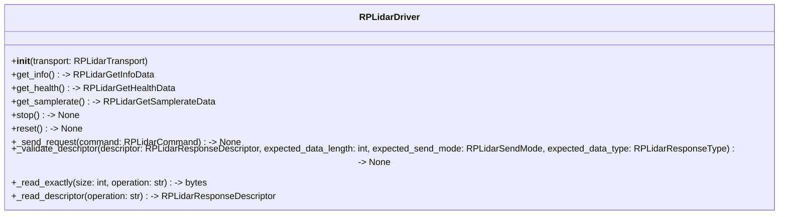

# RPLIDAR Driver API Documentation

## Responsibilities
The RPLIDAR Driver is responsible for managing the communication with the RPLIDAR device, including sending commands and receiving responses. The driver will govern the communication protocol. This layer acts as the high-level interface, which abstracts the underlying communication protocol and provides a simplified interface for interacting with the RPLIDAR device.

**API Abstraction:** It provides clean, object-oriented function calls such as:
    - `get_info()`
    - `get_health()`
    - `get_samplerate()`
    - `stop()`
    - `reset()`

  
**Data Processing & Conversion:** Using the `protocol` layer, the driver will handle the conversion of raw data received from the RPLIDAR device into structured data formats that can be easily consumed by other components of the system.

**Device State Management:** The driver will maintain the state of the RPLIDAR device, including tracking whether it is currently scanning, stopped, or in an error state. It will also handle any necessary initialization and cleanup procedures.

## Public API
The RPLIDAR Driver provides the following public API methods:
| Method | Description |
|--------|-------------------|
| `get_info() -> RPLidarGetInfoData` | Retrieves the device information from the RPLIDAR device. |
| `get_health() -> RPLidarGetHealthData` | Retrieves the device health status from the RPLIDAR device. |
| `get_samplerate() -> RPLidarGetSamplerateData` | Retrieves the device sample rate from the RPLIDAR device. |
| `stop() -> None` | Stops the RPLIDAR device from scanning. |
| `reset() -> None` | Resets the RPLIDAR device. |
| `_send_request(command: RPLidarCommand) -> None` | Sends a command to the RPLIDAR device. |
| `_validate_descriptor(descriptor: RPLidarResponseDescriptor, expected_data_length: int, expected_send_mode: RPLidarSendMode, expected_data_type: RPLidarResponseType)` | Validates the response descriptor against the expected values. |
| `_read_exactly(size: int, operation: str) -> bytes` | Reads exactly the specified number of bytes from the RPLIDAR device. |
| `_read_descriptor(operation: str) -> RPLidarResponseDescriptor` | Reads the response descriptor from the RPLIDAR device. |

## Class Diagram

## Error Handling
The RPLIDAR Driver will handle errors and exceptions that may occur during communication with the RPLIDAR device. It will raise appropriate exceptions for various error conditions, such as communication timeouts, invalid responses, or device errors. The driver will also provide error codes and messages to help diagnose issues and facilitate troubleshooting.

## Usage Example
```python
from rtrpp.sensors.rplidar.driver import RPLidarDriver
from rtrpp.sensors.rplidar.transport import RPLidarTransport

transport = RPLidarTransport(port='/dev/ttyUSB0')

try:
    transport.open() # Open the serial connection to the RPLIDAR device
    driver = RPLidarDriver(transport)

    info = driver.get_info()  # Retrieve device information
    health = driver.get_health()  # Retrieve device health status
    samplerate = driver.get_samplerate()  # Retrieve device sample rate

finally:
    transport.close() # Close the serial connection to the RPLIDAR device   

```
## Future Enhancements
- Implement `start_scan()` method to initiate scanning on the RPLIDAR device.

