# RPLIDAR Protocol Specification
## Purpose
The purpose of the Protocol layer is to define the communication protocol between the RPLIDAR device and the host system. 

## Responsibilities
The protocol layer is responsible for decoding binary response packet fields and constructing request packets. Additionally, it is responsible for defining command bytes, descriptor structures, constant values, enums, and packet layouts used in the communication process. 

It is not responsible for the following:
- Serial port communication (handled by the Transport layer)
- Read or write bytes to the RPLIDAR device (handled by the Transport layer)
- Managing device state or configuration (handled by the Driver layer)
- Converting scan data to point clouds or other formats (handled by the Driver layer)
- Visualizing or displaying scan data (handled by the Driver layer)
  
It defines protocol constants and provides helpers for constructing command bytes and interpreting protocol structures.

## Request and Response Packet Structure

### Request Packets
All request packets sent to the RPLIDAR device follow a specific structure (Little Endian format):

| SYNC_BYTE | COMMAND | PAYLOAD_SIZE |PAYLOAD | CHECKSUM |
|:---|---|---|---|---|
| 1 byte | 1 byte | 1 byte | 0-255 bytes | 1 byte |
```
Transmission order: SYNC_BYTE -> COMMAND -> PAYLOAD_SIZE -> PAYLOAD -> CHECKSUM
Optional Section: PAYLOAD_SIZE, PAYLOAD, CHECKSUM are optional and only present if the command requires a payload.  
```

Note: The little-endian format means that the least significant byte is stored first. For example, the integer value 0x12345678 would be stored in memory as 0x78 0x56 0x34 0x12.


#### __No Response Requests__:
| Command | Value | Payload | Response Mode | Timeout | Operation |
|---------|-------|---------|----------------|---------|-----------|
| STOP | 0x25 | N/A | None | 1 millisecond | Exits current state and enters idle state. |
| RESET | 0x40 | N/A | None | 2 millisecond | Resets the device (Reboot). |

#### __Multiple Response Requests__:
| Command | Value | Payload | Response Mode | Timeout | Operation |
|---------|-------|---------|----------------|---------|-----------|
| SCAN | 0x20 | N/A | Multiple Response | 5 seconds | Starts scanning and returns scan data. |
| EXPRESS_SCAN | 0x82 | Yes | Multiple Response | 5 seconds | Enters scanning state and operates at highest speed. |
| FORCE_SCAN | 0x21 | N/A | Multiple Response | 5 seconds | Enters scanning state and forces data output w/o checking rotation speed. |

#### __Single Response Requests__:
| Command | Value | Payload | Response Mode | Timeout | Operation |
|---------|-------|---------|----------------|---------|-----------|
| GET_INFO | 0x50 | N/A | Single Response | 5 seconds | Retrieves device information. |
| GET_HEALTH | 0x52 | N/A | Single Response | 5 seconds | Retrieves device health status. |
| GET_SAMPLERATE | 0x59 | N/A | Single Response | 5 seconds | Retrieves device sample rate. |
| GET_LIDAR_CONF | 0x84 | Yes | Single Response | 5 seconds | Retrieves device configuration. |


### Request Building
The `build_request()` function is a helper function that constructs a request packet to be sent to the RPLIDAR device. It takes a command and an optional payload, and returns a `RPLidarRequest` object that can be converted to bytes for transmission. The function ensures that the command is a valid `RPLidarCommand` and that the payload size does not exceed 255 bytes. If the command is invalid or the payload size exceeds the limit, it raises a `ValueError`. Additionally, the function must take timing into account to ensure that all bytes within the request packet are transmitted within 5 seconds, as the RPLIDAR device has a timeout for receiving complete packets. If the request packet is not fully transmitted within this time frame, the device may not respond correctly.

### Response Descriptors
All response descriptors received from the RPLIDAR device follow a specific structure (Little Endian format):

| SYNC_BYTE | SYNC_BYTE_RESPONSE | DATA_LENGTH | SEND_MODE | DATA_TYPE |
|:---|---|---|---|---|
| 1byte | 1byte | 30bits | 2bits | 1byte |
```
Transmission order: SYNC_BYTE -> SYNC_BYTE_RESPONSE -> DATA_LENGTH -> SEND_MODE -> DATA_TYPE
```

Send mode is a 2-bit field that indicates the mode of data transmission. The possible values are:
- 0x0: Single Request - Single Reponse mode. The device will send a single response packet for the request.
- 0x1: Single Request - Multiple Response mode. The device will continuously send out multiple response packets with the same format for the current session.


Data type is a 1-byte field that indicates the type of data being sent in the response. The possible values are:
- 0x81: Measurement data response. 
- 0x82: Express measurement data response.
- 0x84: Extended/Dense measurement data response.
- 0x04: Device information response.
- 0x06: Device health response.

### Parsing Workflow
The general workflow for parsing a response descriptor packet is as follows:
1. Receive the response descriptor packet from the RPLIDAR device. 
2. Validate the packet length and structure.
3. Validate the protocol-specific fields based on the command type.
4. Extract the fields based on the defined structure.
5. Convert fixed-point values to floating-point values if necessary.
6. Construct data structures (e.g., `RPLidarResponseDescriptor`, `RPLidarScanData`, etc.) to represent the parsed data.
7. Return the constructed data structures for further processing by the driver layer.


### Data Packets
There are no common formats and packet length for data packets, as they are dependent on the command. 

__SCAN Request and Response__
Request Packet: |A5|20|
Response Descriptor: |A5|5A|05|00|00|40|81|
Response Mode: __Multiple__
Data Response Length: __5 bytes__

SCAN Response Data Packet Format:

Unless the RPLIDAR is in the Protective Stop State the data packet format is as follows:

Byte 0: quality (6 bits) + start flag (1 bit) + inverse start flag (1 bit)
Byte 1: lower angle bits(7 bits) + check bit (1 bit)
Byte 2: upper angle bits (8 bits)
Byte 3: lower distance bits (8 bits)
Byte 4: upper distance bits (8 bits)


__GET_INFO Request and Response__:
Request Packet: |A5|50|
Response Descriptor: |A5|5A|14|00|00|00|04
Response Mode: __Single__
Data Response Length: __20 bytes__


Byte 0: Model (1 byte)
Byte 1: Firmware minor version (1 byte)
Byte 2: Firmware major version (1 byte)
Byte 3: Hardware version (1 byte)
Byte 4-19: Serial number (16 bytes)

__GET_HEALTH Request and Response__:
Request Packet: |A5|52|
Response Descriptor: |A5|5A|03|00|00|00|06
Response Mode: __Single__
Data Response Length: __3 bytes__

Byte 0: Status (1 byte)
Byte 1-2: Error code (2 bytes)

status values:
- 0: Good
- 1: Warning
- 2: Error

error code values:
- Related error code that caused a warning or error status. 

__GET_SAMPLERATE Request and Response__:
Request Packet: |A5|59|
Response Descriptor: |A5|5A|04|00|00|00|15
Response Mode: __Single__
Data Response Length: __4 bytes__

Byte 0: Tstandard sample rate (1 byte) [7:0]
Byte 1: Texpress sample rate (1 byte) [15:8]
Byte 2: Texpress (1 byte) [7:0]
Byte 3: Tstandard (1 byte) [15:8]

Tstandard: (SCAN mode) Time interval for a single laser scan in microseconds. 
Texpress: (EXPRESS_SCAN mode) Time interval for a single laser scan in microseconds.

__GET_LIDAR_CONF Request and Response__:
Request Packet: |A5|84|S|Request Data|C|
Response Descriptor: |A5|5A|S|00|00|00|20
Response Mode: __Single__
Data Response Length: __Variable__

Byte 0-3: type (32 bits)

Byte 4: payload[0]    ⎤
...                   ⎪ - option specific data
Byte n+4: payload[n]  ⎦


|Field Name | Description | Notes |
|-----------|-------------|-------|
| type | Configuration type | This is the same 'type' value as in the request packet. |
| payload[n] | Configuration value | Refer to definition of configuration entry for the specific formate and length of the payload data. |

| Type | Description | Payload Size |
|------|-------------|--------------|
| uint8 | 8-bit unsigned integer | 1 byte |
| uint16 | 16-bit unsigned integer | 2 bytes |
| uint32 | 32-bit unsigned integer | 4 bytes |
| uint64 | 64-bit unsigned integer | 8 bytes |
| sint8 | 8-bit signed integer | 1 byte |
| sint16 | 16-bit signed integer | 2 bytes |
| sint32 | 32-bit signed integer | 4 bytes |
| sint64 | 64-bit signed integer | 8 bytes |
| string | UTF-8 encodeding (ended with 0, and no BOM Header) | Variable length |
| float | 32-bit floating point number | 4 bytes |
| double | 64-bit floating point number | 8 bytes |

Configuration type values: (To be filled in with specific configuration types and their corresponding payload sizes and descriptions.)


### Timing Requirements

| Command | Timeout |
|---------|---------:|
| STOP | 1 ms |
| RESET | 2 ms |
| GET_INFO | 5 s |
| GET_HEALTH | 5 s |
| SCAN | 5 s |


## Public API
| Name | Type | Description |
|------|------|-------------|
| `SYNC_BYTE` | constant | Request start byte. |
| `SYNC_BYTE_RESPONSE` | constant | Response start byte. |
| `COMMAND_TIMEOUTS` | dict | Dictionary mapping RPLIDAR commands to their respective timeout values. |
| `RPLidarCommand` | enum | Named command values for RPLIDAR commands. |
| `RPLidarResponseType` | enum | Named response type values for RPLIDAR responses. |
| `RPLidarSendMode` | enum | Named send mode values for RPLIDAR responses. |
| `RPLidarHealthStatus` | enum | Named health status values for RPLIDAR device health. |
| `RPLidarRequest` | dataclass | Represents a command request packet that is converted to bytes to be sent to the RPLIDAR device. |
| `RPLidarResponseDescriptor` | dataclass | Represents a response descriptor packet that is parsed from bytes received from the RPLIDAR device. |
| `RPLidarScanData` | dataclass | Represents a 5 byte data packet that is parsed from bytes received from the RPLIDAR device in SCAN mode. |
| `build_request` | function | Function that builds a request byte for the driver to send to the lidar device. |
| `parse_response_descriptor` | function | Function that parses a response descriptor packet from bytes received from the RPLIDAR device. |
| `parse_scan_data` | function | Function that decodes the raw scan data received from the RPLIDAR device using SCAN request into a structured format.
| `parse_get_info_response` | function | Function that decodes the raw device information data received from the RPLIDAR device using GET_INFO request into a structured format. |
| `parse_get_health_response` | function | Function that decodes the raw device health data received from the RPLIDAR device using GET_HEALTH request into a structured format. |
| `parse_get_samplerate_response` | function | Function that decodes the raw device sample rate data received from the RPLIDAR device using GET_SAMPLERATE request into a structured format. |
<!-- | `parse_get_lidar_conf_response` | function | Function that decodes the raw device configuration data received from the RPLIDAR device using GET_LIDAR_CONF request into a structured format. | -->


## Class Diagram

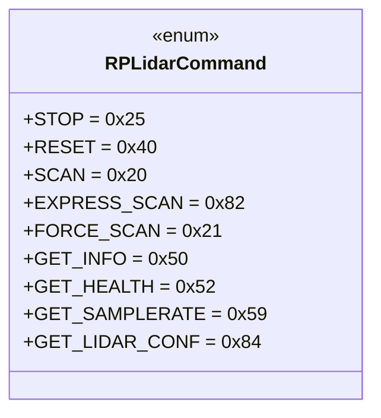
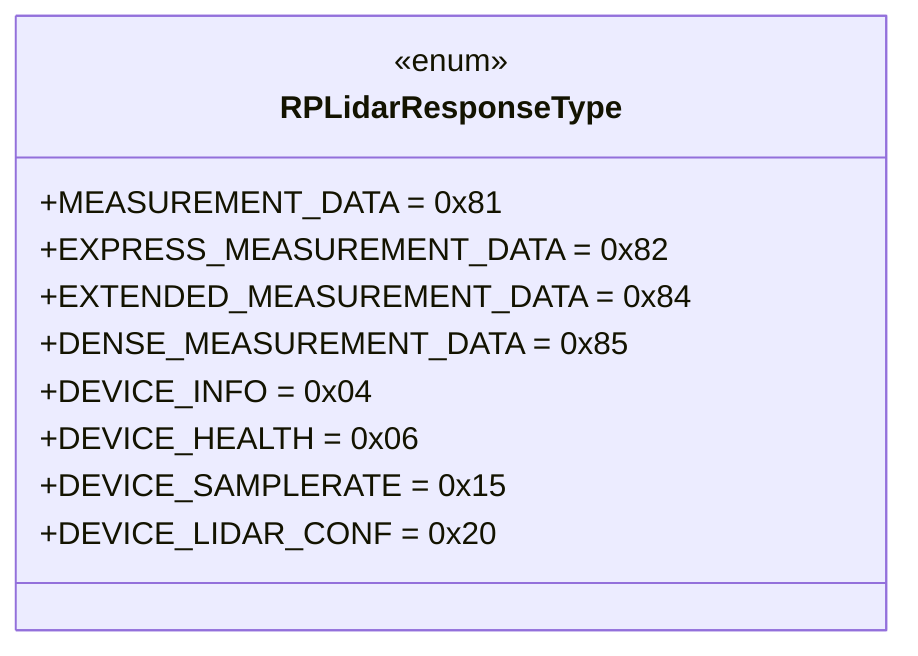
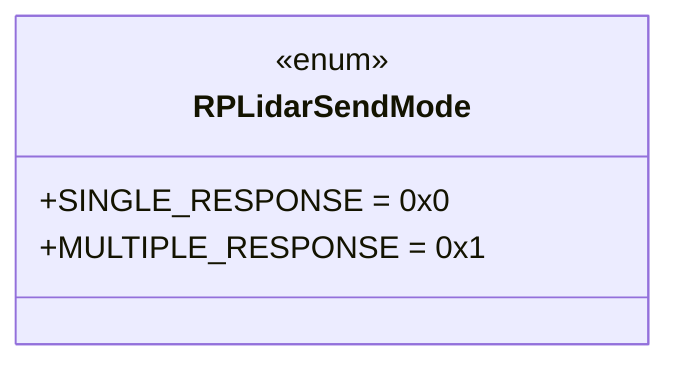
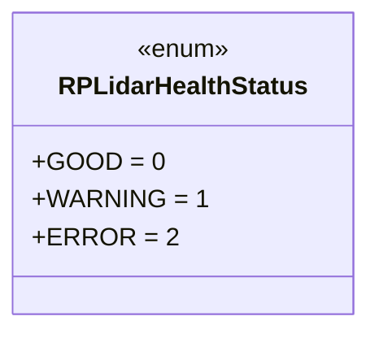
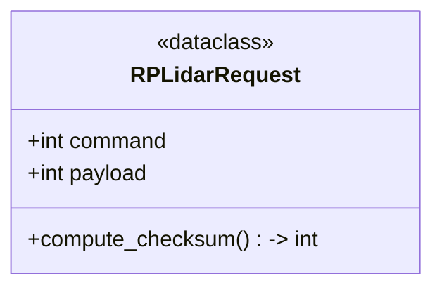
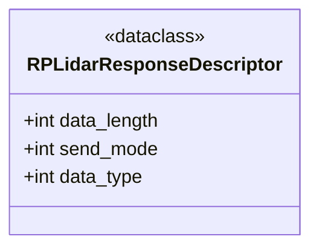
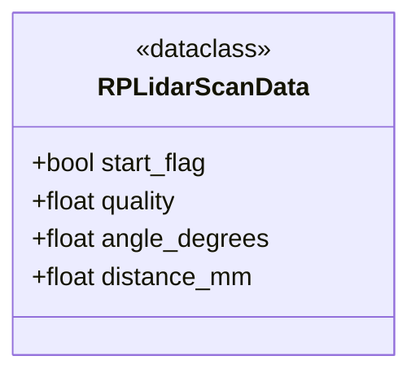
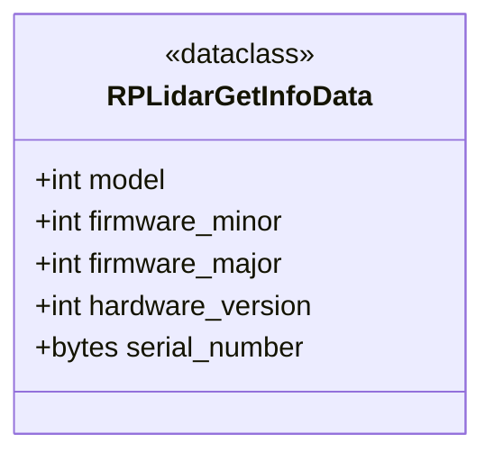
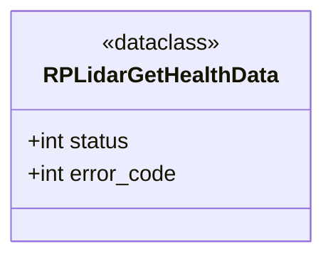
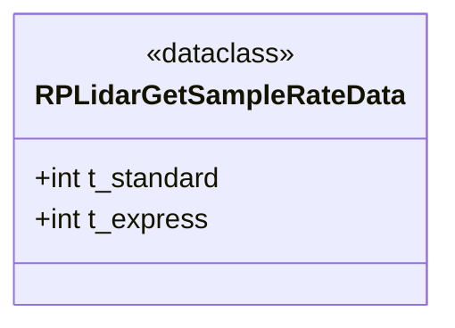
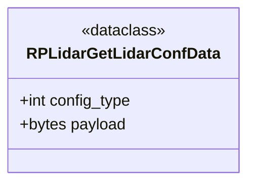

## Error Handling
- `RPLidarRequest` raises `ValueError` if the command is not an instance of `RPLidarCommand`.
- `RPLidarRequest` raises `ValueError` if the payload size exceeds 255 bytes.
- `build_request()` raises `ValueError` if the command is not an instance of `RPLidarCommand`.
- `parse_response_descriptor()` raises `ValueError` if the correct start flags are not present in the response descriptor packet. 
- `parse_response_descriptor()` raises `ValueError` if the response descriptor packet size is not 7 bytes.
- `parse_response_descriptor()` raises `ValueError` if the send mode is not valid.
- `parse_response_descriptor()` raises `ValueError` if the data length is not valid.
- `parse_response_descriptor()` raises `ValueError` if the data type is not valid.
- `parse_scan_data()` raises `ValueError` if the input data size is not 5 bytes.
- `parse_scan_data()` raises `ValueError` if the start flag and inverse start flag are not valid.
- `parse_scan_data()` raises `ValueError` if the check bit is not valid.
- `parse_get_info_response()` raises `ValueError` if the input data size is not 20 bytes.
- `parse_get_health_response()` raises `ValueError` if the input data size is not 3 bytes.
- `parse_get_health_response()` raises `ValueError` if the status value is not valid.
- `parse_get_samplerate_response()` raises `ValueError` if the input data size is not 4 bytes
<!-- - `parse_get_lidar_conf_response()` raises `ValueError` if the input data size is less than 4 bytes or if the payload size exceeds the maximum allowed size of 255 bytes. -->
  
## Usage Example
```python
from rtrpp.sensors.rplidar.protocol import RPLidarCommand, build_request, parse_scan_data

# Build a request packet to start scanning
request_packet = build_request(RPLidarCommand.SCAN)

# Parse a response descriptor packet
response_descriptor_packet = b"\xa5\x5a\x05\x00\x00\x40\x81"  # Example packet
response_descriptor = parse_response_descriptor(response_descriptor_packet)
# Parse a scan data packet
scan_data_packet = b"\x00\x00\x00\x00\x00"  # Example packet
scan_data = parse_scan_data(scan_data_packet)
```
## Future Extensions
Future work may include adding support for additional RPLIDAR commands, response types, and data packet formats as new features are introduced in the RPLIDAR device. Additionally, improvements to error handling and validation of protocol structures may be implemented to enhance robustness and reliability.