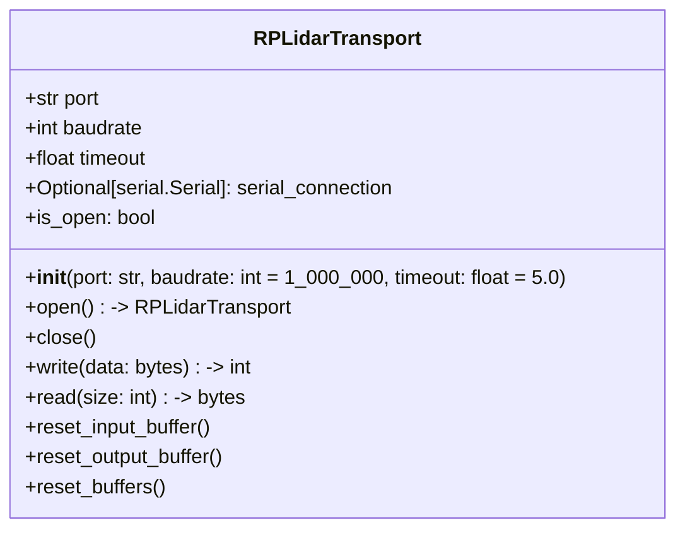

## Purpose
The RPLidarTransport class is responsible for low-level serial communication with the RPLIDAR device. 

## Responsibilities
This class is responsible for opening and closing the serial port, reading and writing raw bytes to the RPLIDAR device, flushing buffers, and managing the serial connection. It does not handle RPLIDAR commands, responses, packets, or scan data.

## Public API

| Method | Description |   
|--------|-------------|
| `open() -> RPLidarTransport` | Opens the serial connection to the RPLIDAR device. |
| `close()` | Closes the serial connection to the RPLIDAR device. |
| `is_open` | Returns True if the serial connection is open, False otherwise. |
| `write(data: bytes) -> int` | Writes raw bytes to the RPLIDAR device. |
| `read(size: int) -> bytes` | Reads raw bytes from the RPLIDAR device. |
| `reset_input_buffer()` | Resets the input buffer of the serial connection. |
| `reset_output_buffer()` | Resets the output buffer of the serial connection. |
| `reset_buffers()` | Resets both the input and output buffers of the serial connection. |

## Class Diagram

## Error Handling
- `read()` raises `RuntimeError` if the connection is not open.
- `write()` raises `RuntimeError` if the connection is not open.
- Serial connection errors are propagated from `pyserial`.

## Usage Example
```python
from rtrpp.sensors.rplidar.transport import RPLidarTransport

transport = RPLidarTransport(port)
transport.open() # Open the serial connection to the RPLIDAR device

raw_command = b'\xA5\x20'  # Example command to start scanning
transport.write(raw_command)  # Example command to start scanning
response = transport.read(7)  # Read the response descriptor

transport.close() # Close the serial connection to the RPLIDAR device
```

## Future Extensions
Future work may include adding support for additional transport protocols (e.g., USB, Bluetooth) and implementing error handling and recovery mechanisms for communication failures.

